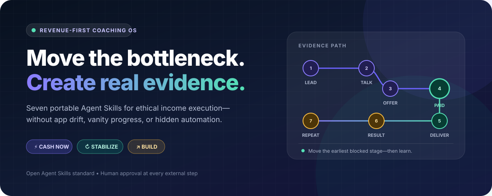
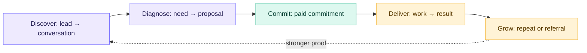
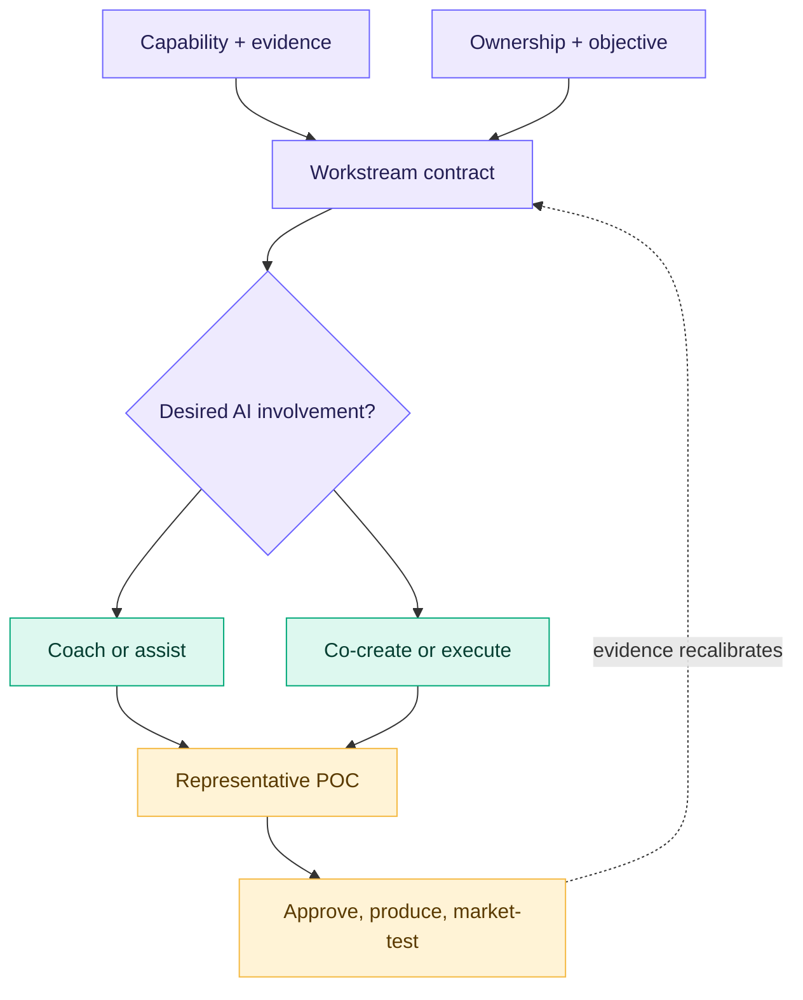
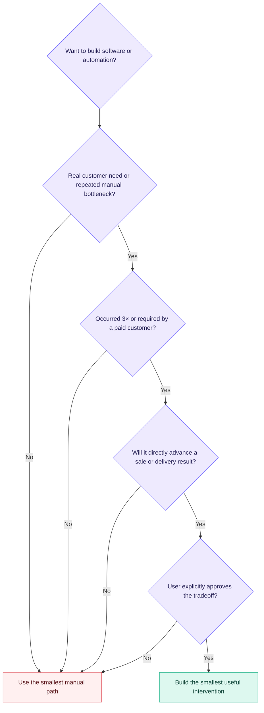
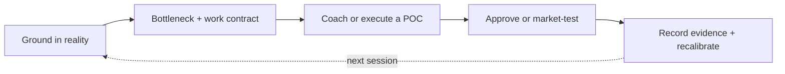

<p align="center">
  
</p>

<p align="center">
  <a href="https://github.com/izestylusx/revenue-coach/actions/workflows/test.yml"></a>
  <a href="https://agentskills.io/"></a>
  
  
  
  <a href="LICENSE"></a>
</p>

<p align="center">
  A portable, adaptive coaching and execution system for AI coding agents.<br>
  It matches help to the user, produces real deliverables, and turns them into market evidence—without app drift.
</p>

<p align="center">
  <a href="#30-second-install"><strong>Install</strong></a> ·
  <a href="docs/quickstart-id.md"><strong>Panduan Indonesia</strong></a> ·
  <a href="docs/framework.md"><strong>Framework</strong></a> ·
  <a href="docs/adaptive-collaboration.md"><strong>Collaboration</strong></a> ·
  <a href="docs/architecture.md"><strong>Architecture</strong></a> ·
  <a href="evals/README.md"><strong>Behavior Evals</strong></a>
</p>

---

## The problem it solves

AI agents can generate far more plans, code, research, and systems than a person can validate in the real world. When the goal is income, that abundance often becomes sophisticated avoidance.

Revenue Coach changes the unit of progress:

> **Not “what did we build?”—but “what evidence moved closer to voluntary exchange?”**

| Default agent drift | Revenue Coach behavior |
| --- | --- |
| Builds a CRM before there are leads | Starts a small, relevant lead list |
| Designs an app for a manual research project | Produces the actual research deliverable |
| Expands five business ideas at once | Selects one revenue experiment |
| Treats the user as globally “beginner” or “expert” | Maps capability and desired AI help per workstream |
| Gives advice when the user asked for production | Executes the agreed internal deliverable and pauses at useful checkpoints |
| Optimizes branding before conversations | Creates market contact first |
| Counts documents, code, and followers | Tracks replies, proposals, cash, and results |
| Acts externally when tools are available | Requires explicit human confirmation |

## The revenue evidence path



The earliest blocked stage is the current bottleneck. The system coaches or executes the smallest move that advances it.

## Three modes, one focus

<table>
  <tr>
    <td width="33%" valign="top">
      <h3>⚡ Cash now</h3>
      <p><strong>When:</strong> income is urgent or no reliable paid path exists.</p>
      <p><strong>Move:</strong> sell a narrow, manually deliverable service or paid pilot using existing capability.</p>
    </td>
    <td width="33%" valign="top">
      <h3>🔁 Stabilize</h3>
      <p><strong>When:</strong> paid evidence exists, but acquisition, conversion, pricing, or delivery is inconsistent.</p>
      <p><strong>Move:</strong> repeat and improve the path that already shows signal.</p>
    </td>
    <td width="33%" valign="top">
      <h3>📈 Build</h3>
      <p><strong>When:</strong> revenue is stable enough to productize, delegate, or compound.</p>
      <p><strong>Move:</strong> add leverage without starving the working revenue engine.</p>
    </td>
  </tr>
</table>

The WIP limit is deliberately strict: **one primary revenue experiment and at most one long-term asset.**

## One user, different AI roles

Capability does not decide delegation. An expert may delegate because time is scarce; a beginner may retain the work because learning matters. Revenue Coach creates a small contract for each active workstream.



| Mode | Agent role | User role |
| --- | --- | --- |
| **Coach** | teach, question, challenge, critique | decide and execute |
| **Assist** | provide research, briefs, raw material, checklists | assemble the deliverable |
| **Co-create** | draft and iterate | direct, select, and edit |
| **Execute** | produce the agreed internal deliverable | approve defined checkpoints |
| **Operate** | repeat a proven approved procedure | monitor exceptions and external actions |

For a social media template business, the same system can support a designer with research and copy, implement designs for a campaign strategist, or produce a bounded end-to-end POC for a concept owner. [See the complete collaboration model](docs/adaptive-collaboration.md).

## The anti-app-drift gate



Coding ability is not treated as evidence that code is the right business intervention.

## Eleven focused skills

| Skill | Use it when you need to… |
| --- | --- |
| **`revenue-coach`** | run the control loop, collaboration contract, routing, focus, and safety rules |
| **`revenue-diagnose`** | establish the baseline, capabilities, desired help, bottleneck, and earning lane |
| **`revenue-opportunity-scan`** | compare current online and local paths against location, constraints, tools, and evidence |
| **`revenue-local-path`** | verify and launch a location-dependent job, gig, service, or small business path |
| **`revenue-sprint`** | turn one hypothesis into a focused 7- or 14-day market experiment |
| **`revenue-daily`** | run a brief check-in and choose one 15–45 minute action |
| **`revenue-offer`** | shape the smallest credible paid offer from existing capability and proof |
| **`revenue-outreach`** | draft ethical prospecting, networking, referral, and follow-up messages |
| **`revenue-tool-router`** | verify the minimum plugin, MCP, app, or manual fallback needed for approved work |
| **`revenue-execute`** | coach, co-create, or produce a POC and revenue-enabling deliverable |
| **`revenue-review`** | review evidence and decide what to continue, change, or stop |

Each skill is small, independently discoverable, and loaded only when relevant.

## 30-second install

Requires Node.js 18 or newer. No API key, database, SaaS account, or runtime dependency.

### Codex, Cursor, Gemini CLI, GitHub Copilot, or OpenCode

```bash
npx --yes github:izestylusx/revenue-coach install
```

Installs to the interoperable user path `~/.agents/skills`.

### Claude Code

```bash
npx --yes github:izestylusx/revenue-coach install --agent claude
```

Installs to `~/.claude/skills`.

### Project-only install

```bash
npx --yes github:izestylusx/revenue-coach install --scope project
```

Use `--dry-run` to preview all changes. The installer refuses to overwrite modified or unmanaged skills unless `--force` is given—and forced replacements are backed up first.

See the complete [installation matrix and recovery behavior](docs/installation.md).

## Start a coaching workspace

Optional local continuity uses four human-readable files—no database:

```bash
npx --yes github:izestylusx/revenue-coach init
```

```text
.revenue-coach/
├── PROFILE.md       goals, capabilities, desired AI help, tools, and boundaries
├── STATE.md         experiment, ownership map, POC, bottleneck, and next action
├── PIPELINE.csv     minimal manual prospect pipeline
└── LOG.md           append-only evidence and decision history
```

Business state is git-ignored by default. Persistence is optional, and the coach must ask before initializing it.

Then ask naturally:

```text
Use revenue-diagnose. Help me choose the fastest ethical income path
from what I already know, own, and can credibly deliver.
```

Or in Indonesian:

```text
Gunakan revenue-daily. Saya punya 30 menit hari ini.
Pilih satu aksi yang paling dekat ke paid conversation.
```

Ask it to execute—not only advise:

```text
Use revenue-execute. I own the campaign strategy and final art direction.
You own niche research, raw copy, three editable design POCs, and a draft listing.
Stop for review after the first representative set.
```

Or scan a location-dependent path:

```text
Use revenue-opportunity-scan. Compare realistic online and offline paths for my city,
current skills, equipment, time, and urgency. Verify what is available now.
```

## How a session works



Every session ends with:

- a named owner—user, agent, or shared;
- one observable action;
- an exact target or artifact;
- a 15–45 minute user timebox when the action is user-owned;
- a visible “done when” signal;
- a review time.

## Safety by design

Revenue Coach may coach and execute approved internal work. It does **not** autonomously:

- send outreach or publish content;
- purchase, subscribe, or accept commercial terms;
- install or connect services, submit applications, or upload sensitive documents;
- quote a final price or commit the user externally;
- scrape restricted data or automate spam;
- fabricate proof, credentials, demand, urgency, or scarcity;
- guarantee revenue or replace professional legal, tax, financial, employment, or mental-health advice.

The user retains control over every external action and business decision.

## Portable architecture

```text
revenue-coach/
├── skills/          11 portable Agent Skills
├── templates/       private, optional coaching state
├── src/             dependency-free installer and validator
├── evals/           14 high-risk behavior regression cases
├── tests/           installer, portability, and guardrail tests
└── docs/            framework, architecture, and bilingual guidance
```

The skills use the open [`SKILL.md` specification](https://agentskills.io/specification). Product-specific behavior is isolated to install-path selection, so the coaching instructions remain portable.

## Quality checks

```bash
npm install --ignore-scripts
npm run validate
npm test
npm pack --dry-run
```

- 11 portable skills structurally validated
- 14 automated tests
- 14 model-level behavior scenarios
- 0 runtime dependencies
- recoverable install, update, and uninstall behavior

## Contributing

Read [CONTRIBUTING.md](CONTRIBUTING.md) before proposing a feature. New complexity should identify the revenue bottleneck it improves, the user evidence behind it, and why a smaller instruction change is insufficient.

## License

[MIT](LICENSE) © 2026 Ikram Ikhsan Rafif.

Revenue Coach is educational and operational support. Outcomes remain uncertain; market conditions, execution, timing, and chance all matter.
